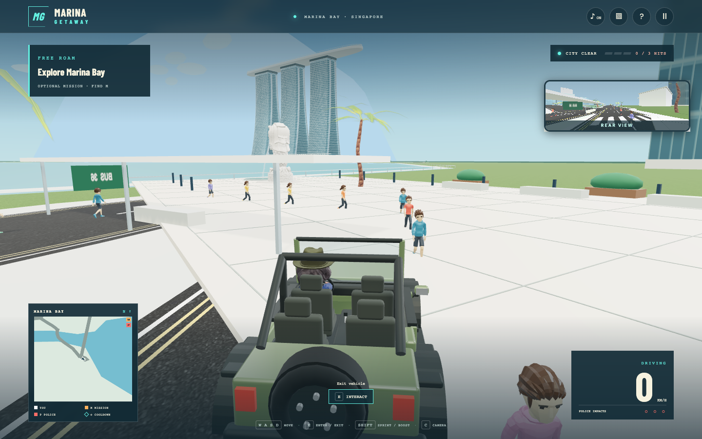

# Wobble City

**Play on desktop:** [tinyurl.com/wobble-city](https://tinyurl.com/wobble-city) · [ChatGPT Sites](https://wobble-city.mohantyabhijit.chatgpt.site)

Both versions are public. Use a desktop or laptop with a keyboard.

A desktop-only, single-player 3D game set around Singapore’s Marina Bay. Choose a wobblehead character, explore the waterfront, get into cars, collect gems and escape the police.

Built with Three.js and Vite, combining the `astra-game` city and simulation with the characters, vehicles, animation and landmark assets from [Wobble Heads](https://github.com/ss-pratapIIITB/wobble-heads). Runs in the browser without a backend, API keys or runtime asset CDN.



## Modes

- **Free roam:** choose Kai or Rae, watch the Merlion introduction, then explore on foot or in a car. No race starts automatically.
- **Marina Gem Run:** an optional driving mission. Visit **M** on the map and enter the designated mission sports car to begin.
- **Police pursuit:** hitting a person with a car or punching someone starts a chase. Escape to a cooldown area to return to free roam.

## How to avoid the police

Drive around pedestrians and officers, and avoid punching people. If you trigger a pursuit, two police cars follow slowly for the first **5 seconds**, then speed up. Use the countdown to gain distance and the rear-view mirror to watch behind you.

Follow the **amber route** to a **◇ cooldown area**, get behind cover, and stop. Once you are out of police sight, the on-screen **5-second cooldown** begins. Stay parked and hidden until **HEAT CLEARED** appears. Moving, leaving cover or being spotted resets the countdown; simply driving far away does not end the chase.

Three distinct police-car impacts cause an explosion and respawn near the Merlion. Your collected gems are preserved. **P** marks the police station, not a safe zone.

## How to collect gems and win

1. Follow **M** to the mission and press **E** beside its sports car to get in.
2. Follow the guided route and drive through the glowing gems. Each gem gives **500 points** and restores some boost.
3. Gems can only be collected while driving with the mission active and the police heat cleared. If chased, finish the cooldown, then resume collecting.
4. Collect **all 24 gems** to complete Marina Gem Run and earn a **3,000-point completion bonus**.

Completing the gem mission is the win condition. Free roam continues afterward, so you can keep exploring; there is no final game-over screen or mandatory race. Mission progress survives pursuits and respawns.

## Controls

| Key | Action |
| --- | --- |
| W / S or ↑ / ↓ | Walk forward/backward; accelerate/brake/reverse in a car |
| A / D or ← / → | Turn or steer |
| Shift | Run on foot; boost while driving |
| E | Enter a nearby usable car; exit after slowing down |
| F | Punch on foot |
| Space | Jump on foot / handbrake while driving |
| C | Switch camera |
| M | Expand/collapse the map |
| R | Recover the car to a safe road position |
| Esc / P | Pause/resume |
| N | Mute/unmute |

## Current game scope

- **Downtown Marina Bay:** a bounded 1.83 × 1.57 km district with connected roads, bridges and Bayfront Drive. The road network uses a game-scale interpretation of the 2026 Marina Bay circuit.
- **Landmarks:** imported Merlion and Marina Bay Sands, plus Esplanade, Fullerton and Singapore Flyer. Architectural geometry is a game interpretation, not a surveyed replica; building interiors are not playable.
- **Characters and city life:** two selectable characters, civilian pedestrians with persistent identities and varied clothing, walking police patrols and ambient traffic.
- **Vehicles:** 15 parked Jeeps, Minis and sports cars, plus traffic and visible police cars you can take over, with articulated doors and smooth natural boarding. Driving includes speed-sensitive steering, braking, reverse, handbrake and boost, with a 150 km/h cap.
- **Chases:** marked police sports cars with flashing lights and sirens. Two police cars follow slowly (up to 20 km/h) for the first five seconds, with an on-screen countdown, then accelerate into the chase. Police track you outside cooldown areas; five uninterrupted seconds parked and unseen inside cover clear the heat.
- **Consequences:** vehicle impacts knock people down with blood and recovery animations. Officers can shoot and engage at close range. Three distinct police-car impacts lead to an encounter, explosion, flying wobblehead and respawn near Merlion; fatal gunfire also causes respawn.
- **One optional mission:** board the designated mission sports car and follow directions through 24 gems.
- **HUD and cameras:** persistent minimap with **M** for the mission and **P** for the police station, route guidance, heat and impact status, cooldown countdown, close chase camera and a live rear-view mirror on the right.
- **Environment:** four imported tree packs with 20 variants, denser instanced trees and grass with animated wind. Roads have no roadside barriers. A loading cover keeps scene assembly hidden.

This is a playable browser prototype. Multiplayer, a larger mission campaign, interiors, an economy and player-controlled shooting are outside the current scope. Physics and police behavior are arcade approximations.

## How we built it

**Computer use and playtesting.** Codex used browser computer-use tools to open the game in Chrome, interact with the character selector and controls, and inspect the running world, HUD and loading screens. We used those observations to refine the game and verify the hosted versions. Automated Playwright scenarios exercised driving, boarding, police impacts, respawn, mission progress and cooldown; simulation tests checked the underlying rules. Some automated fixtures place actors directly to reproduce a specific situation.

**Trees and environment assets.** The first environment assets included user-supplied Meshy-generated road, tree and groundcover GLBs. We prepared smaller runtime copies by optimizing embedded textures. The current tree collection comes from four Quaternius CC0 packs imported through Wobble Heads: palms, broadleaf, birch and pine, with 20 variants in total. Code places trees and grass around the district, renders repeated plants in batches, and adds wind bending and leaf flutter while keeping roots anchored.

**Characters, cars and landmarks.** We integrated the Wobble Heads repository’s character rigs, articulated vehicles and landmark assets into the Marina Bay game. Kai and Rae use existing character models with their upstream credits retained; civilian rigs receive varied clothing colours. The Merlion uses a credited sculpt, while Marina Bay Sands uses geometry authored in Wobble Heads from architectural references. Roads, buildings and city details combine procedural geometry with imported models. See the asset credits below for provenance and licenses.

**Movement and animation.** Wobble Heads supplies procedural posing, inverse kinematics for connected arms and legs, and damped spring motion for the wobbleheads. We adapted these to walking, dancing, jumping, punching, reactions and falling. Boarding combines a path around the vehicle with door, hand and seat animations. Driving uses arcade steering, acceleration, braking and wheel animation; pedestrians follow city routes, avoid obstacles and choose another clear route when blocked. All of this runs locally in Three.js in the browser.

## Run locally

Requires Node.js 22.12 or newer.

```sh
npm ci
npm run dev -- --port 5187 --strictPort
```

Open [localhost:5187](http://localhost:5187/).

```sh
npm run build
npm run preview
```

The production build is written to `dist/`.

## Verification

```sh
npm test
npx playwright install chromium
npm run test:browser
npm run build
```

On macOS with Chrome installed, use `PLAYWRIGHT_CHANNEL=chrome npm run test:browser`. Simulation tests cover boarding, driving, pursuit, cooldown, collisions, melee, officer gunfire, recovery and world boundaries. Browser tests cover assets, selection, desktop interactions, loading, cinematic introduction and the mobile-device gate.

Longer input-driven scenarios are available through `npm run test:route`, `npm run test:gameplay` and `npm run test:cooldown`. These are development playtests, separate from the core test suite. Browser fixtures sometimes position actors directly to reproduce interactions; passing them is not a claim that every possible chase or route has been tested.

## Deployment

Vercel builds the project as a Vite application using `npm run build` and serves `dist/`; configuration is in `vercel.json`. No environment variables are required. GitHub Actions runs automated verification. Production publication is separate from local test results.

```sh
vercel --prod
```

## Project layout

| Path | Responsibility |
| --- | --- |
| `src/desktop.js`, `src/main.js`, `src/style.css` | Desktop gate, input, selection and HUD |
| `src/simulation.js`, `src/physics.js`, `src/collision-world.js` | Game states, driving and collision simulation |
| `src/boarding.js`, `src/melee.js`, `src/police-*.js` | Boarding, combat and officers |
| `src/district.js`, `src/navigation.js` | Map, roads, world bounds and guidance |
| `src/world.js`, `src/landmarks.js`, `src/city-details.js` | Scene, cameras and landmarks |
| `src/environment-assets.js`, `src/rear-view.js` | Planting, wind and mirror rendering |
| `src/wobble/` | Imported Wobbleheads modules and game adapters |
| `public/assets/` | Local models, textures, metadata and source credits |
| `tests/` | Simulation tests and browser/input-driven playtests |

## Asset credits and history

Game code uses the repository’s MIT license. Third-party assets retain their own terms; the code license does not replace their licenses.

- [Wobbleheads integration and character provenance](src/wobble/README.md).
- [Merlion credits](public/assets/merlion/CREDITS.md): Singapore Merlion ReSculpt by cymon, based on keeganTeo’s model, CC BY 4.0.
- [Marina Bay Sands credits](public/assets/marina-bay-sands/CREDITS.md): original Wobbleheads game geometry, imported from `94be054`.
- [Tree credits](public/assets/environment/CREDITS.md): Quaternius packs under CC0, imported from `7864e62`.
- [Original environment asset sources](assets/README.md), [asset provenance](public/assets/provenance.json) and [map references](docs/REFERENCES.md).

Historical files and screenshots in `artifacts/`, `docs/INTEGRATION-VERIFICATION.md` and `marina.md` may describe earlier versions. This README describes the current intended scope; fresh test output and the deployed build establish the current release state.
