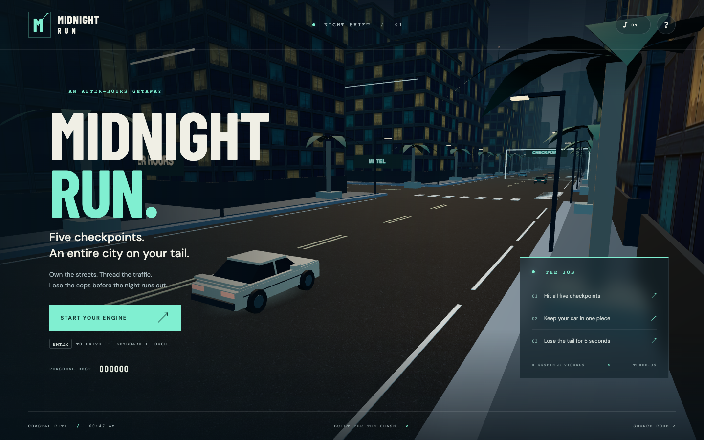

# Midnight Run

A complete 3D browser car chase through a coastal city after dark. Hit five checkpoints, dodge traffic, and leave the police more than 48 metres behind for five seconds to escape.

**[Play online](https://mohantyabhijit.github.io/astra-game/)** · **[Download source](https://github.com/mohantyabhijit/astra-game/archive/refs/heads/main.zip)**



## Play

| Control | Action |
| --- | --- |
| W / Up | Accelerate |
| S / Down | Brake, then reverse |
| A / D or Left / Right | Steer |
| Space | Handbrake / drift |
| Shift | Nitro boost |
| C | Switch between close and high follow cameras |
| Esc / P | Pause / resume |
| R | Recover a stuck car, costs 250 points; five-second cooldown |
| M | Mute / unmute |

Touch controls appear on touch devices. The game pauses when the window loses focus or the tab is hidden. Personal best scores are saved locally when browser storage is available.

Start with 150 seconds. Each checkpoint adds 15 seconds, 1,000 points, 12 integrity points, and 35 nitro units. Driving earns two points per metre; close calls with traffic earn 150. A clean escape earns 2,500 plus 20 points per remaining second. Runs end when the clock or integrity reaches zero, or police pin the player at low speed for five seconds.

Brake before corners, look at the mint route on the map, and save nitro for the straight after the final checkpoint. Buildings block police vision: when a cruiser loses sight, it continues toward your last known position.

## Run locally

Requires Node.js 22.12+ and a recent browser with WebGL 2.

```sh
npm ci
npm run dev
```

Open the address printed by Vite. Build a static release with `npm run build`, then use `npm run preview` to inspect it. All runtime assets and fonts are served from the same origin; the game has no API keys, login, backend, or third-party runtime service requirement.

## Verify

```sh
npm test
npm run test:route
npx playwright install chromium
npm run test:browser
npm run build
```

If Chrome is already installed, `PLAYWRIGHT_CHANNEL=chrome npm run test:browser` uses it. Browser tests launch an isolated profile. The test server uses port 5187 with strict port matching to avoid testing another local app.

The simulation suite covers acceleration, braking, reverse steering, nitro, frame-rate consistency, oriented car collisions, building collisions, pause, recovery, checkpoint ordering, close calls, police routing and occlusion, escape, and failure. The route test drives a full run through ordinary inputs with all traffic and police present; it never teleports or edits mission state. Browser tests exercise keyboard driving through the first gate, pursuit, boost, pause/help, touch driving, and collision/result/restart screens. Result-screen tests use explicitly prepared scenarios; the separate route test establishes an end-to-end win.

## Source map

- `src/simulation.js` — deterministic simulation at 120 Hz, arcade grip and steering, OBB vehicle collisions, building collision response, traffic, police pursuit, mission rules and scoring.
- `src/world.js` — Three.js city and vehicle meshes, materials, follow cameras, dynamic lights, and static geometry batching.
- `src/main.js` — fixed-step loop, keyboard/touch controls, HUD, map, pause and results.
- `src/audio.js` — locally synthesized engine, police sirens and reward chimes.
- `src/style.css` and `index.html` — responsive interface and accessibility semantics.
- `tests/` — simulation, route and browser checks.
- `.github/workflows/deploy.yml` — test, build and publish to GitHub Pages on pushes to `main`.

## Higgsfield art

The connected Higgsfield plugin generated four images using `gpt_image_2`:

| Asset | Use |
| --- | --- |
| `reference` | Art direction for the cream coupe, cyan towers, warm lights and coastal city; viewable from the controls panel |
| `asphalt` | Repeating road surface material |
| `facade` | Building façade color and emissive texture |
| `vehicle` | Pearl paint material on player, traffic and police vehicles |

Original PNGs are in `art/originals/`. Optimized WebP assets are in `public/assets/`. Generation job IDs, exact prompts, model and processing details are recorded in `public/assets/provenance.json`. Run `npm run assets` to reproduce the resized WebP files from the originals. All 3D geometry is created in source; generated images are references and textures, not 3D models.

## Scope

A single-player arcade game with one handcrafted checkpoint route and a procedurally assembled district. Physics intentionally favors responsive arcade handling. There are no pedestrians, weapons, multiplayer, or accounts. Touch controls have browser emulation coverage; performance depends on the device GPU.
